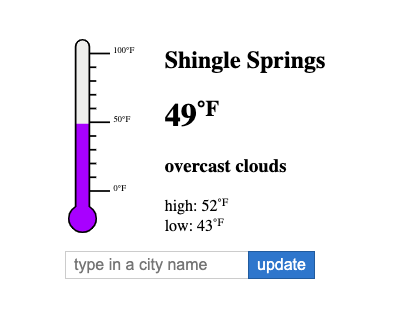

# Simple VueJS Temperature Gauge Example

This is a simple temperature gauge application that I created for my blog to compare and contrast React, Vue and Angular. https://thewebhacker.com/react-vs-vue-vs-angular-showdown-part2-vue/

To run this application you need node and nvm installed. Here's how you can get it up and running:

1. Clone the repo into a local directory.
2. In that directory run `nvm use && npm install`
2. Now start the application by running `npm run start`
4. Sign up for free API credentials at [Open Weather](https://home.openweathermap.org/) and plug them into `src/services/OpenWeatherService.ts`

You're up and running. Hack around with it then come tell me what you think!